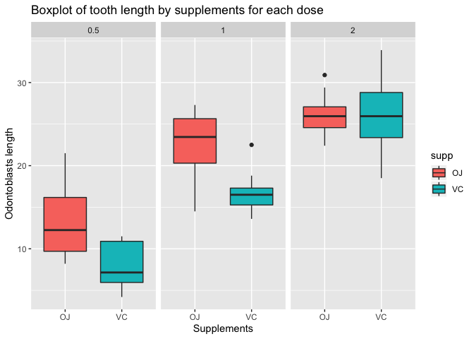

Practice Assignment
================

Part 1: Create a README
=======================

See homepage for details.

Part 2: Data inspection with R
==============================

The dataset `Titanic` would be used for this part.

Part 2.1: Passenger breakdown
-----------------------------

``` r
dat <- data.frame(Titanic)
```

**How many children and adults were on Titanic?**

``` r
child.num <- sum(dat$Age == "Child")
adult.num <- sum(dat$Age == "Adult")
```

-   There are 16 children and 16 adults on the Titantic.

**Were there more female adult or male adult passengers?**

``` r
# count the number of adults and kids for each sex
less <- sum(dat$Age == "Adult" & dat$Sex == "Female") <
  sum(dat$Age == "Adult" & dat$Sex == "Male")
equal <- sum(dat$Age == "Adult" & dat$Sex == "Female") == 
  sum(dat$Age == "Adult" & dat$Sex == "Male")

if(equal)
{print("Equal")} else if (less)
{print("More female")} else{print("More male")}
```

    ## [1] "Equal"

-   There are equal number of female and male on the ship.

Part 2.2: Survival
------------------

**Did the children have better survival rate than the adults?**

``` r
sum(dat$Age == "Child" & dat$Survived == "Yes")
```

    ## [1] 8

``` r
sum(dat$Age == "Adult" & dat$Survived == "Yes")
```

    ## [1] 8

-   8 individuals survived for both children and adults. Hence survival rate is the same.

**Which class of passengers have a better survival rate? (Crew, first class, second class, third class)**

``` r
dat %>% 
  group_by(Class) %>% 
  count(Survived) %>% 
  kable()
```

| Class | Survived |    n|
|:------|:---------|----:|
| 1st   | No       |    4|
| 1st   | Yes      |    4|
| 2nd   | No       |    4|
| 2nd   | Yes      |    4|
| 3rd   | No       |    4|
| 3rd   | Yes      |    4|
| Crew  | No       |    4|
| Crew  | Yes      |    4|

-   Number of survivers (4 alive) are the same across all 4 classes.

Part 3: Data Visualization
==========================

``` r
dat2 <- ToothGrowth

ggplot(aes(x = supp, y = len), data = dat2) + 
  geom_boxplot(aes(fill = supp)) + facet_wrap(~ dose) +
  ggtitle("Boxplot of tooth length by supplements for each dose") +
  xlab("Supplements") + ylab("Odontoblasts length")
```



The figure above shows the relationship among the types of supplements used, dosage of each type of supplements, and the odontoblasts' length in 60 guinea pigs. I am interested in exploring how would different combinations of supplements and their dosages alter the odontoblasts' length as well as depicting descriptive statistics like variance, median, max, and min related to length. Hence, boxplot is the most effective and easiest visualization tool to accomplish this goal.

Based on the figure, the result of the experiment seems to suggest that regardless of the types of supplements, a higher dosage of vitamin C intake is associated with a greater length. Furthermore, the median length from the orange juice group seems to be higher than that of the vitamin C group for all 3 dosages, although the difference is very small for the 2mg/day dosage groups. Lastly, the distribution of length is approximately symmetric for both VC and OJ in the 2mg/day dosage group whereas that is visibly skewed for the other dosage groups.
