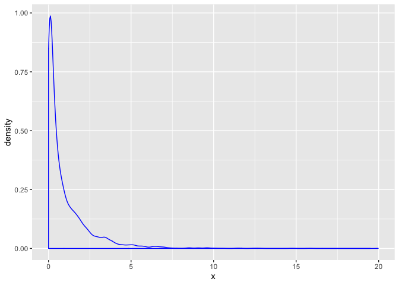
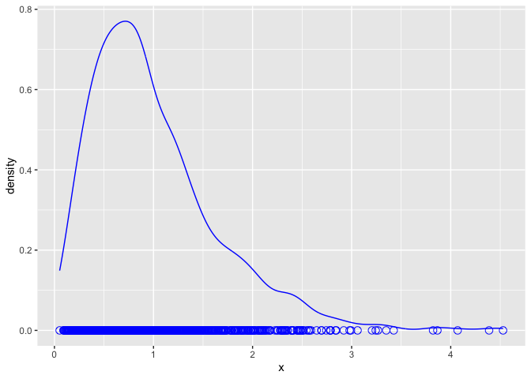

Sem2c
================

Simulate 1000 samples with sample size 5 from *χ*<sub>(1)</sub><sup>2</sup> distribution.

``` r
set.seed(888888)

n <- 5
N <- 1000
df <- 1
chi.sim <- rchisq(n = N * n, df = df)

tibble(x = chi.sim) %>% 
  ggplot() + 
  geom_density(aes(x = x), color = "blue")
```



Above shows the probability density distribution of the simulated data.

``` r
# organize 1000 samples in row format
samps <- matrix(chi.sim, nrow = N, ncol = n)
samp.mu <- rowMeans(samps) 

head(samp.mu)
```

    ## [1] 0.7766123 1.9567942 0.4949378 2.5637276 0.8803120 0.4219304

``` r
tibble(x = samp.mu) %>% 
  ggplot() + 
  geom_line(aes(x = x), stat = "density", color = "blue") +
  geom_point(aes(x = x, y = 0), color = "blue", shape = 1, size = 3)
```



Conclusion: Under small sample size, CLT does not hold well because the above pdf does not look similar to a normal distribution.
