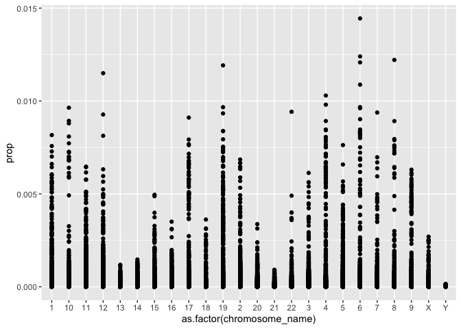
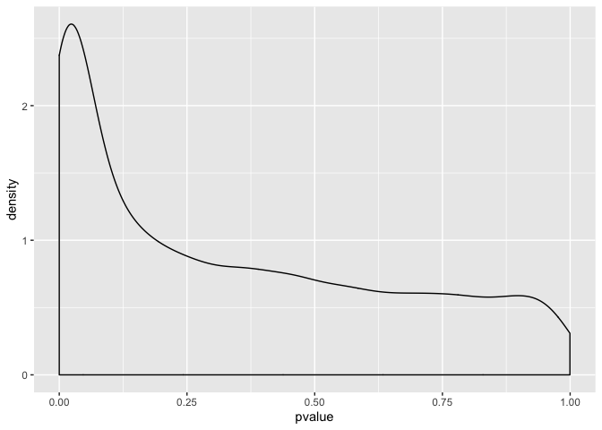

Sem3
================

Part 2 Exercise
===============

Part 1
======

``` r
gds <- getGEO("GDS507")
```

    ## File stored at:

    ## /var/folders/x1/5m_wh63x6fb3zj_920nbwmzc0000gn/T//Rtmpf62M4M/GDS507.soft.gz

    ## Parsed with column specification:
    ## cols(
    ##   ID_REF = col_character(),
    ##   IDENTIFIER = col_character(),
    ##   GSM11815 = col_double(),
    ##   GSM11832 = col_double(),
    ##   GSM12069 = col_double(),
    ##   GSM12083 = col_double(),
    ##   GSM12101 = col_double(),
    ##   GSM12106 = col_double(),
    ##   GSM12274 = col_double(),
    ##   GSM12299 = col_double(),
    ##   GSM12412 = col_double(),
    ##   GSM11810 = col_double(),
    ##   GSM11827 = col_double(),
    ##   GSM12078 = col_double(),
    ##   GSM12099 = col_double(),
    ##   GSM12269 = col_double(),
    ##   GSM12287 = col_double(),
    ##   GSM12301 = col_double(),
    ##   GSM12448 = col_double()
    ## )

``` r
meta_data <- data.frame(Sample = gds@dataTable@columns$sample, disease = gds@dataTable@columns$disease.state)
gds_data <- gds@dataTable@table
head(gds_data)
```

    ##        ID_REF IDENTIFIER GSM11815 GSM11832 GSM12069 GSM12083 GSM12101 GSM12106
    ## 1 200000_s_at      PRPF8   4254.0   5298.2   4026.5   3498.4   3566.4   4903.1
    ## 2   200001_at     CAPNS1  17996.2  12010.7  10283.5   2534.7  11048.4  13354.0
    ## 3   200002_at      RPL35  41678.8  39116.9  38758.9  32847.7  39633.9  43511.2
    ## 4 200003_s_at    MIR6805  65390.9  34806.2  31257.2  28308.5  67447.5  56989.9
    ## 5   200004_at     EIF4G2  19030.1  15813.6  16355.7   9579.7  14273.5  17217.0
    ## 6   200005_at      EIF3D   8824.5   9706.2  10590.0   6986.7   9400.4  12835.2
    ##   GSM12274 GSM12299 GSM12412 GSM11810 GSM11827 GSM12078 GSM12099 GSM12269
    ## 1   6372.6   4829.1   5205.8   2756.8   3932.0   3729.9   3223.4   3640.5
    ## 2   8563.8  17247.6  16018.5   6077.0  15703.8  10138.5  11614.4   8460.5
    ## 3  46856.7  47032.4  22152.2  26660.7  26373.6  23809.6  24749.3  21936.8
    ## 4  57972.5  57570.5  29062.2  35140.9  23629.3  22100.5  21651.0  18550.7
    ## 5  19116.9  17487.6  14671.6  17733.1  18022.4  17957.4  15958.0  15799.8
    ## 6  10299.0  12375.2   7645.4   8661.5   7355.7   6973.4   6855.9   7949.2
    ##   GSM12287 GSM12301 GSM12448
    ## 1   4886.3   4070.2   3482.1
    ## 2  10282.6  11844.3   9741.6
    ## 3  31462.8  22733.7  25395.5
    ## 4  23496.5  21315.4  28631.4
    ## 5  16685.8  18817.3  17421.1
    ## 6   9486.5   7494.5   7252.1

``` r
melted_data <- melt(gds_data, id.vars = c("ID_REF", "IDENTIFIER"), var = "Sample")
head(melted_data)
```

    ##        ID_REF IDENTIFIER   Sample   value
    ## 1 200000_s_at      PRPF8 GSM11815  4254.0
    ## 2   200001_at     CAPNS1 GSM11815 17996.2
    ## 3   200002_at      RPL35 GSM11815 41678.8
    ## 4 200003_s_at    MIR6805 GSM11815 65390.9
    ## 5   200004_at     EIF4G2 GSM11815 19030.1
    ## 6   200005_at      EIF3D GSM11815  8824.5

``` r
melted_data %>% 
    group_by(Sample) %>% 
    summarize(mean = mean(value))
```

    ## # A tibble: 17 x 2
    ##    Sample    mean
    ##    <fct>    <dbl>
    ##  1 GSM11815  751.
    ##  2 GSM11832  742.
    ##  3 GSM12069  748.
    ##  4 GSM12083  735.
    ##  5 GSM12101  803.
    ##  6 GSM12106  744.
    ##  7 GSM12274  761.
    ##  8 GSM12299  802.
    ##  9 GSM12412  685.
    ## 10 GSM11810  765.
    ## 11 GSM11827  780.
    ## 12 GSM12078  774.
    ## 13 GSM12099  766.
    ## 14 GSM12269  710.
    ## 15 GSM12287  791.
    ## 16 GSM12301  770.
    ## 17 GSM12448  757.

``` r
(new_melted_data <- melted_data %>% 
    group_by(Sample, IDENTIFIER) %>% 
    summarize(Count = mean(value)))
```

    ## # A tibble: 279,905 x 3
    ## # Groups:   Sample [17]
    ##    Sample   IDENTIFIER   Count
    ##    <fct>    <chr>        <dbl>
    ##  1 GSM11815 --Control   8139. 
    ##  2 GSM11815 222968_at    102. 
    ##  3 GSM11815 223641_at    200. 
    ##  4 GSM11815 224429_x_at 2385. 
    ##  5 GSM11815 224438_at     32.1
    ##  6 GSM11815 225714_s_at  291. 
    ##  7 GSM11815 225934_at    284. 
    ##  8 GSM11815 226014_at     66.3
    ##  9 GSM11815 226061_s_at   45.1
    ## 10 GSM11815 226138_s_at   23.3
    ## # … with 279,895 more rows

Part 2 Excerise
---------------

``` r
human = useMart("ensembl", dataset = "hsapiens_gene_ensembl")

identify_gene_names <- function(df){
    names(df) <- c("Sample", "hgnc_symbol", "Count")
    names <- getBM( attributes=c("hgnc_symbol", "chromosome_name",
                                 "transcript_length") , filters= "hgnc_symbol", values = unique(df$hgnc_symbol), mart = human)
    left_join(df, names, by = "hgnc_symbol")
}

identify_gene_names1 <- function(df){
    names(df) <- c("Sample", "hgnc_symbol", "Count")
    names <- getBM( attributes=c("hgnc_symbol", "chromosome_name") , filters= "hgnc_symbol", values = unique(df$hgnc_symbol), mart = human)
    left_join(df, names, by = "hgnc_symbol")
}

data_with_chromosome <- identify_gene_names1(new_melted_data) %>% 
    filter(chromosome_name %in% c(1:23, "X", "Y"))

full_data <- left_join(data_with_chromosome, meta_data, by = "Sample")

full_data %>% 
    group_by(disease) %>% 
    filter(chromosome_name == "X") %>% 
    summarize(mean = mean(Count))
```

    ## # A tibble: 2 x 2
    ##   disease  mean
    ##   <fct>   <dbl>
    ## 1 normal   686.
    ## 2 RCC      658.

Part 3 Exercise
===============

``` r
set.seed(123)
sample_to_choose <- sample(1:length(unique(full_data$hgnc_symbol)), size = 100)

names_to_choose <- as.character(unique(full_data$hgnc_symbol)[sample_to_choose])

full_data %>% 
  mutate(prop = Count/sum(Count)) %>% 
  ggplot(aes(x = as.factor(chromosome_name), y = prop)) + geom_point()
```



Part 4
======

``` r
withp <- full_data %>% 
    group_by(hgnc_symbol) %>% 
    summarize( pvalue = t.test(Count ~ disease)$p.value) 

withp %>%
    ggplot(aes(pvalue)) + geom_density()
```



``` r
sigdata <- withp %>% filter(pvalue < 0.05)
sigdata
```

    ## # A tibble: 2,468 x 2
    ##    hgnc_symbol   pvalue
    ##    <chr>          <dbl>
    ##  1 A1BG-AS1    0.0366  
    ##  2 A2MP1       0.0245  
    ##  3 AADAT       0.0304  
    ##  4 AAK1        0.0229  
    ##  5 AARS2       0.0416  
    ##  6 ABCB1       0.00351 
    ##  7 ABCB10      0.0302  
    ##  8 ABCC3       0.0342  
    ##  9 ABCC6P1     0.000528
    ## 10 ABCG1       0.00795 
    ## # … with 2,458 more rows

``` r
name <- sigdata[which.min(sigdata$pvalue),1]
name
```

    ## # A tibble: 1 x 1
    ##   hgnc_symbol
    ##   <chr>      
    ## 1 CLDN2
