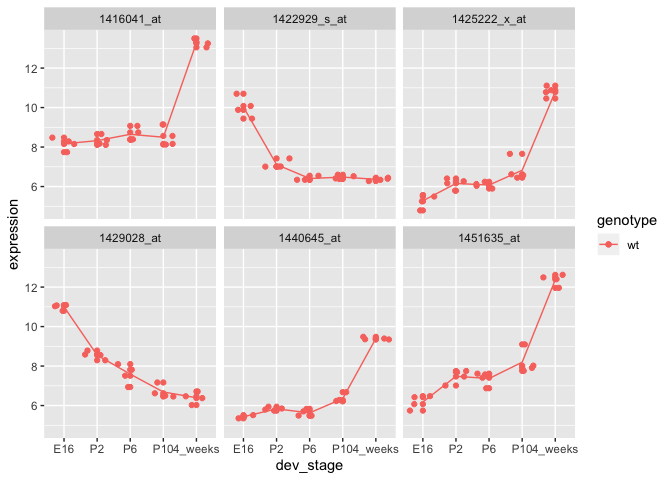
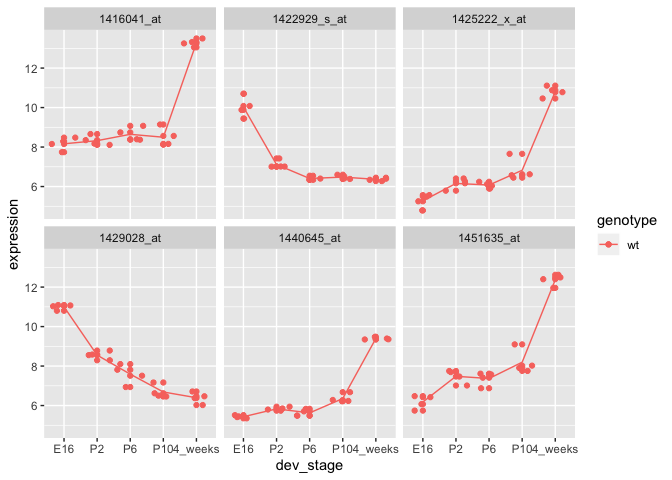
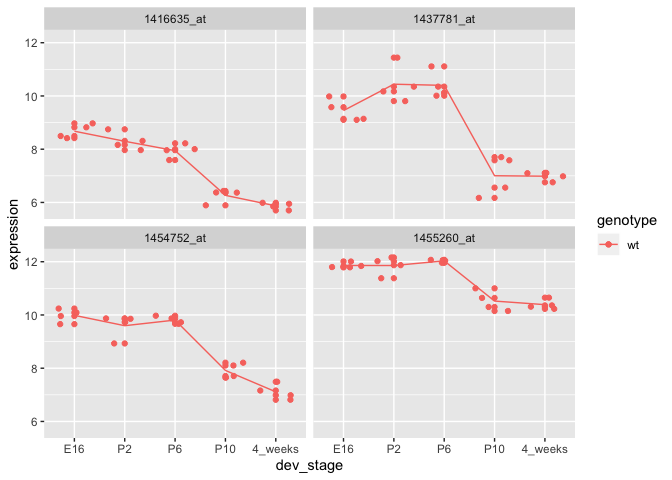
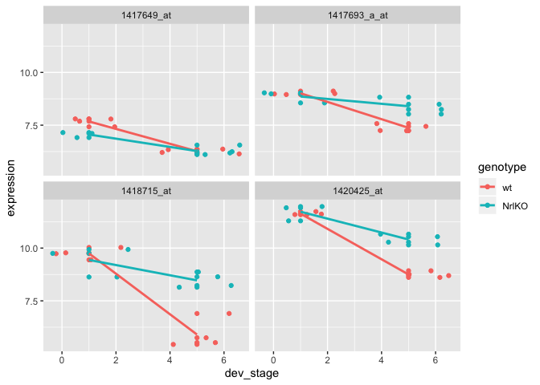

Sem4
================

Part 2: Gene expression data
============================

``` r
expressionMatrix <- fread("https://raw.githubusercontent.com/STAT540-UBC/STAT540-UBC.github.io/master/seminars/seminars_winter_2020/seminar4/expression_data/GSE4051_data.tsv")
```

    ## Warning in fread("https://raw.githubusercontent.com/STAT540-UBC/STAT540-
    ## UBC.github.io/master/seminars/seminars_winter_2020/seminar4/expression_data/
    ## GSE4051_data.tsv"): Detected 39 column names but the data has 40 columns (i.e.
    ## invalid file). Added 1 extra default column name for the first column which is
    ## guessed to be row names or an index. Use setnames() afterwards if this guess
    ## is not correct, or fix the file write command that created the file to create a
    ## valid file.

``` r
names(expressionMatrix)[1] <- "gene"

samplesMetadata <- fread("https://raw.githubusercontent.com/STAT540-UBC/STAT540-UBC.github.io/master/seminars/seminars_winter_2020/seminar4/expression_data/GSE4051_design.tsv")

names(samplesMetadata) <- c("sample_id", "sample_number", "dev_stage", "genotype")

samplesMetadata$dev_stage <- samplesMetadata$dev_stage %>% factor(levels = c("E16", "P2", "P6", "P10", "4_weeks"))

samplesMetadata$genotype <- samplesMetadata$genotype %>% factor(levels = c("wt", "NrlKO"))

expressionMatrix %>% ncol() - 1
```

    ## [1] 39

``` r
samplesMetadata %>% nrow()
```

    ## [1] 39

``` r
expressionMatrix %>% names() %>% sort()
```

    ##  [1] "gene"      "Sample_1"  "Sample_10" "Sample_11" "Sample_12" "Sample_13"
    ##  [7] "Sample_14" "Sample_15" "Sample_16" "Sample_17" "Sample_18" "Sample_19"
    ## [13] "Sample_2"  "Sample_20" "Sample_21" "Sample_22" "Sample_23" "Sample_24"
    ## [19] "Sample_25" "Sample_26" "Sample_27" "Sample_28" "Sample_29" "Sample_3" 
    ## [25] "Sample_30" "Sample_31" "Sample_32" "Sample_33" "Sample_34" "Sample_35"
    ## [31] "Sample_36" "Sample_37" "Sample_38" "Sample_39" "Sample_4"  "Sample_5" 
    ## [37] "Sample_6"  "Sample_7"  "Sample_8"  "Sample_9"

``` r
samplesMetadata$sample_id %>% sort()
```

    ##  [1] "Sample_1"  "Sample_10" "Sample_11" "Sample_12" "Sample_13" "Sample_14"
    ##  [7] "Sample_15" "Sample_16" "Sample_17" "Sample_18" "Sample_19" "Sample_2" 
    ## [13] "Sample_20" "Sample_21" "Sample_22" "Sample_23" "Sample_24" "Sample_25"
    ## [19] "Sample_26" "Sample_27" "Sample_28" "Sample_29" "Sample_3"  "Sample_30"
    ## [25] "Sample_31" "Sample_32" "Sample_33" "Sample_34" "Sample_35" "Sample_36"
    ## [31] "Sample_37" "Sample_38" "Sample_39" "Sample_4"  "Sample_5"  "Sample_6" 
    ## [37] "Sample_7"  "Sample_8"  "Sample_9"

``` r
# melt into a format ggplot can easily work with
meltedExpressionMatrix <- expressionMatrix %>% reshape2::melt(id = "gene") 
```

Part 3: Single gene analysis
============================

``` r
geneIds <- c("1416119_at", "1431708_a_at")

# use dplyr::filter() to get the expression data for the gene
expressionDataForGene <- expressionMatrix %>% filter(gene %in% geneIds)

# transform the data frame into the format that matches the sample metadata
expressionDataForGene <- expressionDataForGene %>%
  as.data.frame() %>% 
  column_to_rownames("gene") %>%
  t() %>% as.data.frame() %>% 
  rownames_to_column("sample_id") %>% 
  reshape2::melt(id = "sample_id") %>% 
  as_tibble() %>% 
  select(sample_id,
         gene = variable, 
         expression = value)

transformGeneExpressionMatrix <- function(expressionMatrix) {
  expressionMatrix <- expressionMatrix %>%
    as.data.frame() %>% 
    column_to_rownames("gene") %>%
    t() %>% as.data.frame() %>% 
    rownames_to_column("sample_id") %>% 
    reshape2::melt(id = "sample_id") %>% 
    as_tibble() %>% 
    select(sample_id,
           gene = variable, 
           expression = value)
  return(expressionMatrix)
}

expressionDataForGene <- expressionMatrix %>% filter(gene %in% geneIds)

expressionDataForGene <- transformGeneExpressionMatrix(expressionDataForGene)


expressionDataForGene <- expressionDataForGene %>% left_join(samplesMetadata, by = "sample_id")


boringGene <- expressionDataForGene %>% filter(gene == "1416119_at")
t.test(expression ~ genotype, boringGene)
```

    ## 
    ##  Welch Two Sample t-test
    ## 
    ## data:  expression by genotype
    ## t = -0.18395, df = 36.534, p-value = 0.8551
    ## alternative hypothesis: true difference in means is not equal to 0
    ## 95 percent confidence interval:
    ##  -0.5079125  0.4233967
    ## sample estimates:
    ##    mean in group wt mean in group NrlKO 
    ##            9.892900            9.935158

``` r
interestingGene <- expressionDataForGene %>% filter(gene == "1431708_a_at")
summary(lm(expression ~ genotype, interestingGene))
```

    ## 
    ## Call:
    ## lm(formula = expression ~ genotype, data = interestingGene)
    ## 
    ## Residuals:
    ##      Min       1Q   Median       3Q      Max 
    ## -1.02445 -0.45124 -0.03874  0.29605  2.00126 
    ## 
    ## Coefficients:
    ##               Estimate Std. Error t value Pr(>|t|)    
    ## (Intercept)     9.5545     0.1406   67.94  < 2e-16 ***
    ## genotypeNrlKO  -1.9767     0.2015   -9.81 7.71e-12 ***
    ## ---
    ## Signif. codes:  0 '***' 0.001 '**' 0.01 '*' 0.05 '.' 0.1 ' ' 1
    ## 
    ## Residual standard error: 0.629 on 37 degrees of freedom
    ## Multiple R-squared:  0.7223, Adjusted R-squared:  0.7148 
    ## F-statistic: 96.24 on 1 and 37 DF,  p-value: 7.713e-12

``` r
interestingGene <- expressionDataForGene %>% filter(gene == "1431708_a_at")
summary(aov(expression ~ dev_stage, interestingGene))
```

    ##             Df Sum Sq Mean Sq F value Pr(>F)
    ## dev_stage    4   2.75  0.6868   0.467  0.759
    ## Residuals   34  49.96  1.4695

Part 4: Lots of Genes
=====================

``` r
wildTypeSamples <- samplesMetadata %>% filter(genotype == "wt")

getExpressionForSamples <- function(sampleIds, expressionMatrix) {
  # use gene column as row name
  dataFrame <- expressionMatrix %>% 
    as.data.frame() %>% 
    column_to_rownames("gene")
  # use give sampleIds to pull out the subset of interest (ORDERING OF SAMPLES IS VERY IMPORTANT)
  return(dataFrame[sampleIds])
}

# use the wildTypeSamples to pull out the wildtype expression data from the expression matrix
wildTypeExpressionMatrix <- getExpressionForSamples(wildTypeSamples$sample_id, expressionMatrix)

wildTypeExpressionMatrix %>% as_tibble()
```

    ## # A tibble: 29,949 x 20
    ##    Sample_20 Sample_21 Sample_22 Sample_23 Sample_24 Sample_25 Sample_26
    ##        <dbl>     <dbl>     <dbl>     <dbl>     <dbl>     <dbl>     <dbl>
    ##  1      7.24      7.41      7.17      7.07      7.11      7.19      7.18
    ##  2      9.48     10.0       9.85     10.1       9.75      9.16      9.49
    ##  3     10.0      10.0       9.91      9.91      9.39     10.1       9.41
    ##  4      8.36      8.37      8.40      8.49      8.37      8.20      8.73
    ##  5      8.59      8.62      8.52      8.64      8.36      8.50      8.39
    ##  6      9.59      9.72      9.71      9.7       9.64      9.65      9.87
    ##  7      9.68     10.4       9.87     10.2       9.15      8.18      9.10
    ##  8      7.24      7.90      7.48      7.49      7.19      7.23      7.06
    ##  9     11.7      11.5      11.5      11.6      11.4      11.3      11.8 
    ## 10      9.21     10.1       9.82      9.92      9.30      9.94      8.77
    ## # … with 29,939 more rows, and 13 more variables: Sample_27 <dbl>,
    ## #   Sample_28 <dbl>, Sample_29 <dbl>, Sample_30 <dbl>, Sample_31 <dbl>,
    ## #   Sample_32 <dbl>, Sample_33 <dbl>, Sample_34 <dbl>, Sample_35 <dbl>,
    ## #   Sample_36 <dbl>, Sample_37 <dbl>, Sample_38 <dbl>, Sample_39 <dbl>

``` r
designMatrix <- model.matrix(~dev_stage, wildTypeSamples)

wildTypeDevStageFit <- lmFit(wildTypeExpressionMatrix, designMatrix)
wildTypeDevStageFitEb <- eBayes(wildTypeDevStageFit)
topTenGenes <- topTable(wildTypeDevStageFitEb)
```

    ## Removing intercept from test coefficients

``` r
topGenes <- rownames(topTenGenes)[1:6]
topGenesExpressionData <- wildTypeExpressionMatrix %>% 
  rownames_to_column("gene") %>% 
  filter(gene %in% topGenes) %>%
  transformGeneExpressionMatrix() %>% 
  left_join(wildTypeSamples, id = "sample_id")
```

    ## Joining, by = "sample_id"

``` r
topGenesExpressionData %>% 
  ggplot(aes(x = dev_stage, y = expression, color = genotype)) +
  geom_point() +
  geom_jitter() +
  stat_summary(aes(y = expression, group=1), fun.y = mean, geom="line") +
  facet_wrap(~gene)
```



``` r
plotGenes <- function(genes, expressionMatrix, samplesMetadata) {
  
  expressionDataForGenes <- expressionMatrix %>% 
    rownames_to_column("gene") %>% 
    filter(gene %in% genes) %>%
    transformGeneExpressionMatrix() %>% 
    left_join(samplesMetadata, id = "sample_id")
  
  expressionDataForGenes %>% 
    ggplot(aes(x = dev_stage, y = expression, color = genotype)) +
    geom_point() +
    geom_jitter() +
    stat_summary(aes(y = expression, group=1), fun.y = mean, geom="line") +
    facet_wrap(~gene)
}

# verify that the function works
plotGenes(topGenes, wildTypeExpressionMatrix, wildTypeSamples)
```

    ## Joining, by = "sample_id"



``` r
allGenes <- topTable(wildTypeDevStageFitEb, number = Inf)
```

    ## Removing intercept from test coefficients

``` r
# construct the contrast matrix
contrastMatrix <- makeContrasts(
  p10vsp6 = dev_stageP10 - dev_stageP6,
  fourweeksVsP10 = dev_stage4_weeks - dev_stageP10,
  levels = designMatrix
)

contrastFit <- contrasts.fit(wildTypeDevStageFit, contrastMatrix)
contrastFitEb <- eBayes(contrastFit)
contrastGenes <- topTable(contrastFitEb)
cutoff <- 1e-04
wtResCont <- decideTests(contrastFitEb, p.value = cutoff, method = "global")


hits1 <- wtResCont %>% 
  as.data.frame() %>% 
  rownames_to_column("gene") %>% 
  filter(p10vsp6 < 0)
plotGenes(hits1$gene, wildTypeExpressionMatrix, wildTypeSamples)
```

    ## Joining, by = "sample_id"



``` r
hits2 <- wtResCont %>% 
  as.data.frame() %>% 
  rownames_to_column("gene") %>% 
  filter(fourweeksVsP10 < 0)

interactionSamples <- samplesMetadata %>% filter(dev_stage %in% c("E16", "4_weeks"))
interactionSamples$dev_stage <- interactionSamples$dev_stage %>% 
  as.character() %>% 
  factor(levels = c("E16", "4_weeks"))

expressionDataForInteractionSamples <- getExpressionForSamples(interactionSamples$sample_id, expressionMatrix)

interactionDesign <- model.matrix(~genotype*dev_stage, interactionSamples)
```

Part 5
======

Make a similar plot but this time for 4 genes where there are no interaction between genotype and developmental stages.
-----------------------------------------------------------------------------------------------------------------------

``` r
set.seed(123456)
interactionFit <- lmFit(expressionDataForInteractionSamples, interactionDesign) %>% eBayes()

cutoff <- 1e-06
changeDirections <- decideTests(interactionFit, p.value = cutoff, method = "global") %>% 
  as.data.frame() %>% 
  rownames_to_column("gene") %>% 
  as_tibble()

hits <- changeDirections %>% filter(dev_stage4_weeks < 0, `genotypeNrlKO:dev_stage4_weeks` == 0)

# lets try plotting 5 on this list

expressionDataForHits <- expressionDataForInteractionSamples %>% 
  rownames_to_column("gene") %>% 
  filter(gene %in% hits$gene[1:4]) %>%
  transformGeneExpressionMatrix() %>% 
  left_join(samplesMetadata, id = "sample_id")
```

    ## Joining, by = "sample_id"

``` r
expressionDataForHits$dev_stage <- expressionDataForHits$dev_stage %>% as.numeric()

expressionDataForHits %>%
  ggplot(aes(x = dev_stage, y = expression, color = genotype)) +
  geom_point() +
  geom_jitter() +
  geom_smooth(method = "lm", se = FALSE) +
  facet_wrap(~gene)
```


