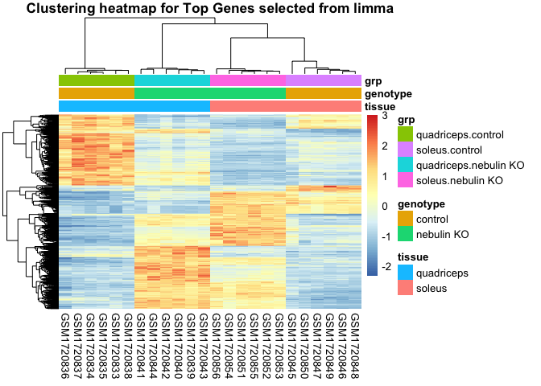
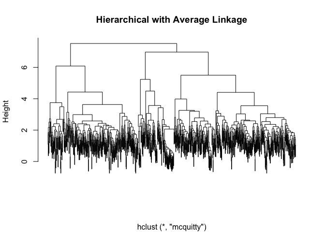
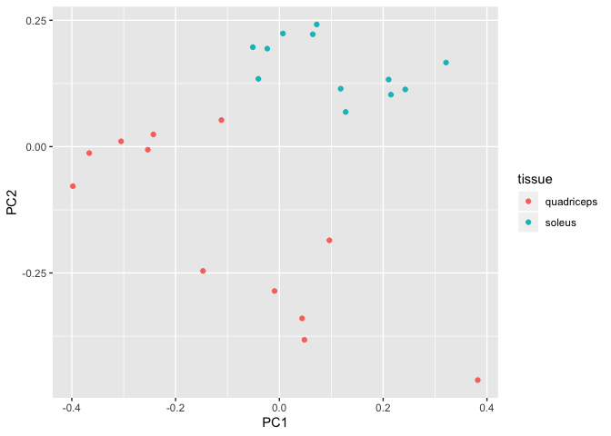

Seminar 6: Dimensionality reduction and Cluster Analysis-Hierarchical
Clustering
================

Read in data and do some cleaning:

``` r
if (file.exists("GSE70213.Rdata")) {
    # if previously downloaded
    load("GSE70213.Rdata")
} else {
    # Get geo object that contains our data and phenotype information
    geo_obj <- getGEO("GSE70213", GSEMatrix = TRUE)
    geo_obj <- geo_obj[[1]]
    save(geo_obj, file = "GSE70213.Rdata")
}
# Get expression data
data <- exprs(geo_obj)

# Get covariate data
prDes <- pData(geo_obj)[, c("organism_ch1", "title", colnames(pData(geo_obj))[grep("characteristics", 
    colnames(pData(geo_obj)))])]

## Clean up covariate data
colnames(prDes) = c("organism", "sample_name", "tissue", "genotype", "sex", "age")
prDes$tissue = as.factor(gsub("tissue: ", "", prDes$tissue))
prDes$genotype = as.factor(gsub("genotype: ", "", prDes$genotype))
prDes$sex = as.factor(gsub("Sex: ", "", prDes$sex))
prDes$age = gsub("age: ", "", prDes$age)
```

Standardizing:

``` r
sprDat <- t(scale(t(data)))
str(sprDat, max.level = 0, give.attr = FALSE)
```

    ##  num [1:35557, 1:24] -0.2042 0.9693 -0.0693 -0.3329 -0.7671 ...

``` r
round(data.frame(avgBefore = rowMeans(head(data)), avgAfter = rowMeans(head(sprDat)), 
    varBefore = apply(head(data), 1, var), varAfter = apply(head(sprDat), 1, var)), 
    2)
```

    ##          avgBefore avgAfter varBefore varAfter
    ## 10338001   2109.42        0 110944.28        1
    ## 10338002     55.62        0     70.82        1
    ## 10338003    645.76        0  22386.92        1
    ## 10338004    280.43        0   7513.48        1
    ## 10338005      2.92        0      0.02        1
    ## 10338006      3.64        0      0.07        1

# Deliverable 1

## Regenerate the pheatmap clustering plot for the top genes, selected from limma, using clustering distance: correlation, and clustering method: mcquitty.

``` r
# compute pairwise distances
data_to_plot = sprDat

pr.dis <- dist(t(data_to_plot), method = "euclidean")

# create a new factor representing the interaction of tissue type and genotype
prDes$grp <- with(prDes, interaction(tissue, genotype))

cutoff <- 1e-05
DesMat <- model.matrix(~grp, prDes)
dsFit <- lmFit(sprDat, DesMat)
dsEbFit <- eBayes(dsFit)
dsHits <- topTable(dsEbFit, coef = grep("grp", colnames(coef(dsEbFit))), 
                   p.value = cutoff, 
    n = Inf)
numBHhits <- nrow(dsHits)

topGenes <- rownames(dsHits)

# Scaled data of topGenes
topDat <- sprDat[topGenes, ]

clust_dist_col = "correlation"   

clust_method = "mcquitty"  

clust_scale = "none" 

pheatmap(topDat, cluster_rows = TRUE, scale = clust_scale,
         clustering_method = clust_method,
         clustering_distance_cols = clust_dist_col, 
         show_colnames = T, show_rownames = FALSE, 
         main = "Clustering heatmap for Top Genes selected from limma", 
         annotation = prDes[, c("tissue", "genotype", "grp")])
```

<!-- -->

# Deliverable 2

## Regenerate the dendrogram on the SAMPLES of this heatmap using the ‘hclust’ and ‘dist’ functions.

K-means clustering:

``` r
set.seed(31)
k <- 5
pr.km <- kmeans(topDat, centers = k, nstart = 50)
```

Generating the dendrogram:

``` r
geneC.dis <- dist(topDat, method = "euclidean")

geneC.hc.a <- hclust(geneC.dis, method = "mcquitty")

plot(geneC.hc.a, labels = F, main = "Hierarchical with Average Linkage", xlab = "")
```

<!-- -->

# Deliverable 3

## Plot the data for this analysis along PCs 1 and 2 using `ggplot` instead base plotting. Color the points by tissue.

``` r
pcs <- prcomp(sprDat, center = FALSE, scale = FALSE)
prinComp <- cbind(prDes, pcs$rotation[rownames(prDes), 1:10])

ggplot(prinComp,aes(x=PC1,y=PC2,color=tissue)) + geom_point()
```

<!-- -->
