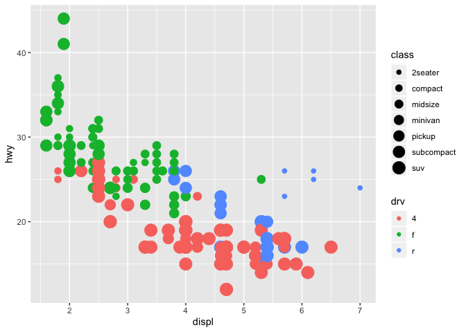

Sem2b
================

Deliverable
===========

``` r
library(tidyverse)
ggplot(data = mpg) + 
  geom_point(mapping = aes(x = displ, y = hwy, size = class, color = drv))
```

    ## Warning: Using size for a discrete variable is not advised.


